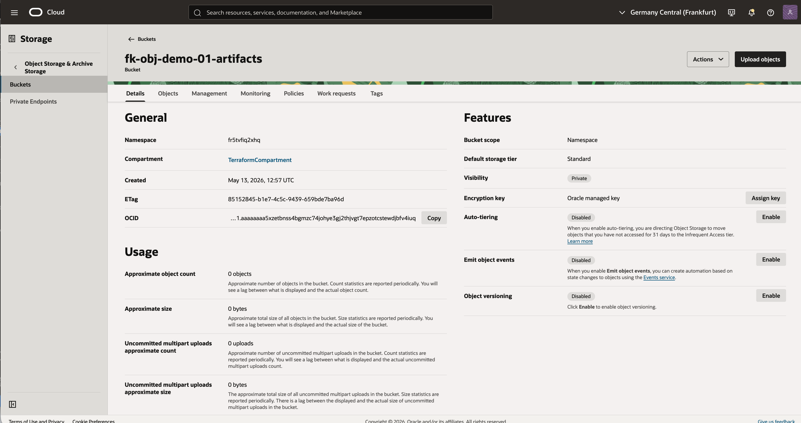

# Example 01: Single Bucket

This example deploys the smallest practical **OCI Object Storage** setup using **Terraform/OpenTofu**: one private bucket in the tenancy namespace.

The goal is to show the most direct consumption pattern for this module without mixing in networking or compute layers.

---

## Architecture Overview

This deployment creates:

- one OCI Object Storage namespace lookup
- one private OCI Object Storage bucket

---

## Example Result

After `tofu apply`, the bucket is visible in the OCI Console as a private Object Storage bucket with the default standard storage tier and Oracle-managed encryption.



---

## Deployment Steps

```bash
tofu init
tofu plan
tofu apply
```

If you prefer Terraform:

```bash
terraform init
terraform plan
terraform apply
```

---

## Cleanup

```bash
tofu destroy
```

Or with Terraform:

```bash
terraform destroy
```

---

## Learn More

Visit [FoggyKitchen.com](https://foggykitchen.com/) for OCI, multicloud, and Terraform/OpenTofu learning resources.

---

## License

Licensed under the **Universal Permissive License (UPL), Version 1.0**.  
See [LICENSE](../../LICENSE) for more details.

---

© 2026 [FoggyKitchen.com](https://foggykitchen.com) - Cloud. Code. Clarity.
