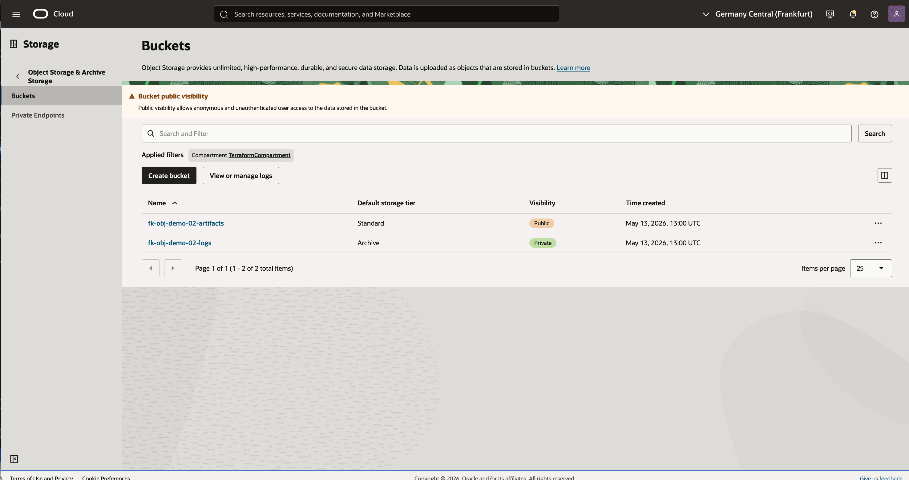

# Example 02: Multiple Buckets

This example extends the basic setup into a more realistic bucket layout: multiple buckets with different access and storage settings.

The goal is to show how the module behaves when Object Storage becomes a shared service for different application concerns such as artifacts and logs.

---

## Architecture Overview

This deployment creates:

- one namespace lookup
- one public-read artifacts bucket
- one archive-tier logs bucket with versioning enabled

---

## Example Result

After `tofu apply`, both buckets are visible in the OCI Console: a public artifacts bucket on the standard tier and a private logs bucket on the archive tier.



---

## Deployment Steps

```bash
tofu init
tofu plan
tofu apply
```

If you prefer Terraform:

```bash
terraform init
terraform plan
terraform apply
```

---

## Cleanup

```bash
tofu destroy
```

Or with Terraform:

```bash
terraform destroy
```

---

## Learn More

Visit [FoggyKitchen.com](https://foggykitchen.com/) for OCI, multicloud, and Terraform/OpenTofu learning resources.

---

## License

Licensed under the **Universal Permissive License (UPL), Version 1.0**.  
See [LICENSE](../../LICENSE) for more details.
